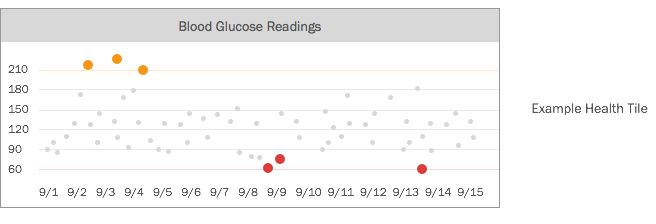
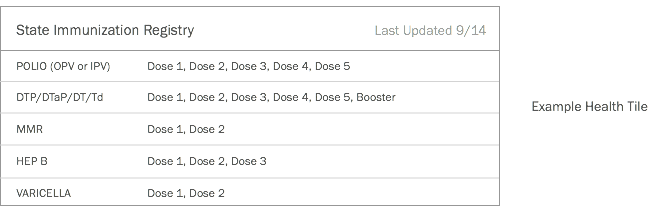
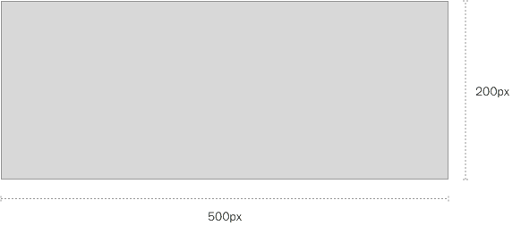

Health Tiles
============
Putting patient generated data at the fingertips of medical professionals.

**Objectives**
- Visualize data from patient sources (devices to applications)
- Integrate visualization within existing medical systems
- Provide hooks for pulling data from patient sources
- Reduce or minimize provider liability

**Technical Goals**
- Use existing standards to create implementation pattern
- Minimize effort on existing medical systems
- Needs to be secure

**Example Tiles**



**Physician Experience**
1. Pulls up a patient's record
2. Sees Health Tile(s) that a patient has added

For a physician or medical professional, seeing patient generated data is as easy as opening up the patient record.

**Patient Experience**
1. Logs into Patient Portal
2. Adds a tile by picking from a list (or entering a URL)
3. Authenticates with external service
4. Successfully adds tile

A patient only has to add the tile once, and it will be linked to their patient record.

Technical Details
============
For Health Tiles to be successful, they need to be **flexible** and **secure**. Flexible enough to allow patient-focused device and applications to express the data they are capturing in meaningful ways. Secure enough to enable these "tiles" to live in the user interface of an Electronic Health Record System.

An implementation pattern can be created using existing standards, specifically relying on HTML 5 and sandboxed IFRAMEs. The IFRAME provides patient-focused developers a canvas (with a fixed height and width) to populate.



Since IFRAMEs are being used, there is **no burden** on EHRs to process, store, or visualize data from patients. An EHR is only required to remember the URLs for each of the tiles and present them.

**Security**
The ```sandbox``` ability of IFRAMES allows us to apply security rules and grant certain privileges to the content being displayed.